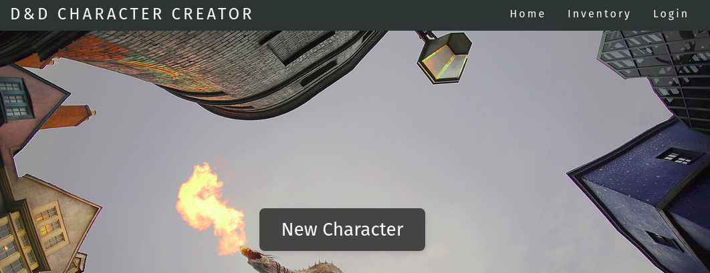

# D&D Character Creation Tool

Final project of web development(2022.2) course at Uni.
The project is a D&D character creator. The user is able to create and store character informations.
It was developed with Django web framework.

## Test

To test the project clone the repository

` git clone https://github.com/yanbentes/DnD-Character-Creator.git `

` cd DnD-Character-Creator `

run the command to install the dependencies

` pip install -r requiriments.txt ` 
	
Since this is not a real product the ` .env ` file with the enviroment variables is on the repository so you don't have to generate a SECRET_KEY. But keep in mind that keeping the SECRET_KEY public is not recommended.

Now to run locally do and access the development server in your browser

` python manage.py runserver --insecure `

the `--insecure` will load staticfiles when DEBUG is set to false on settings.py

